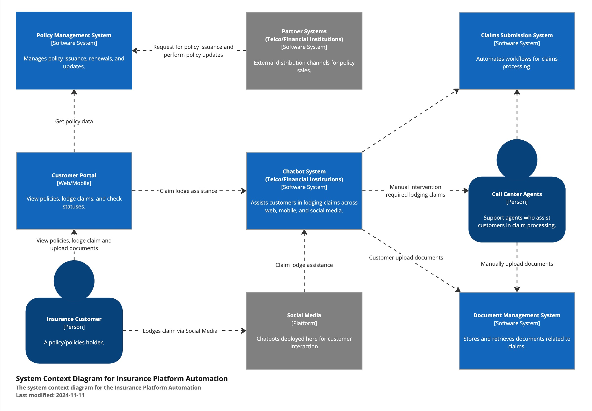
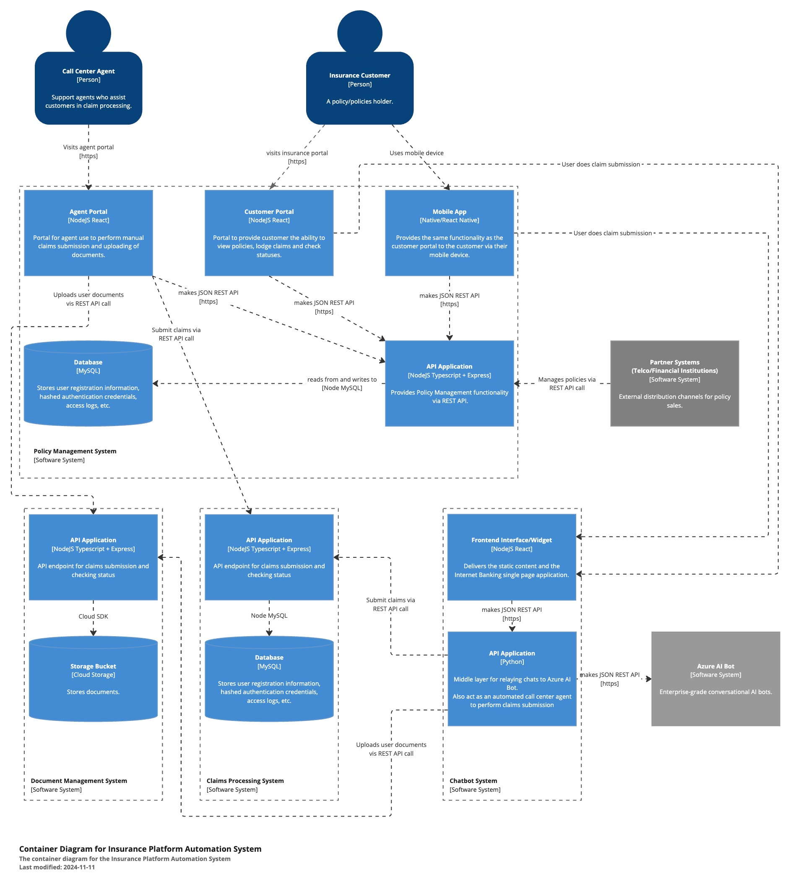
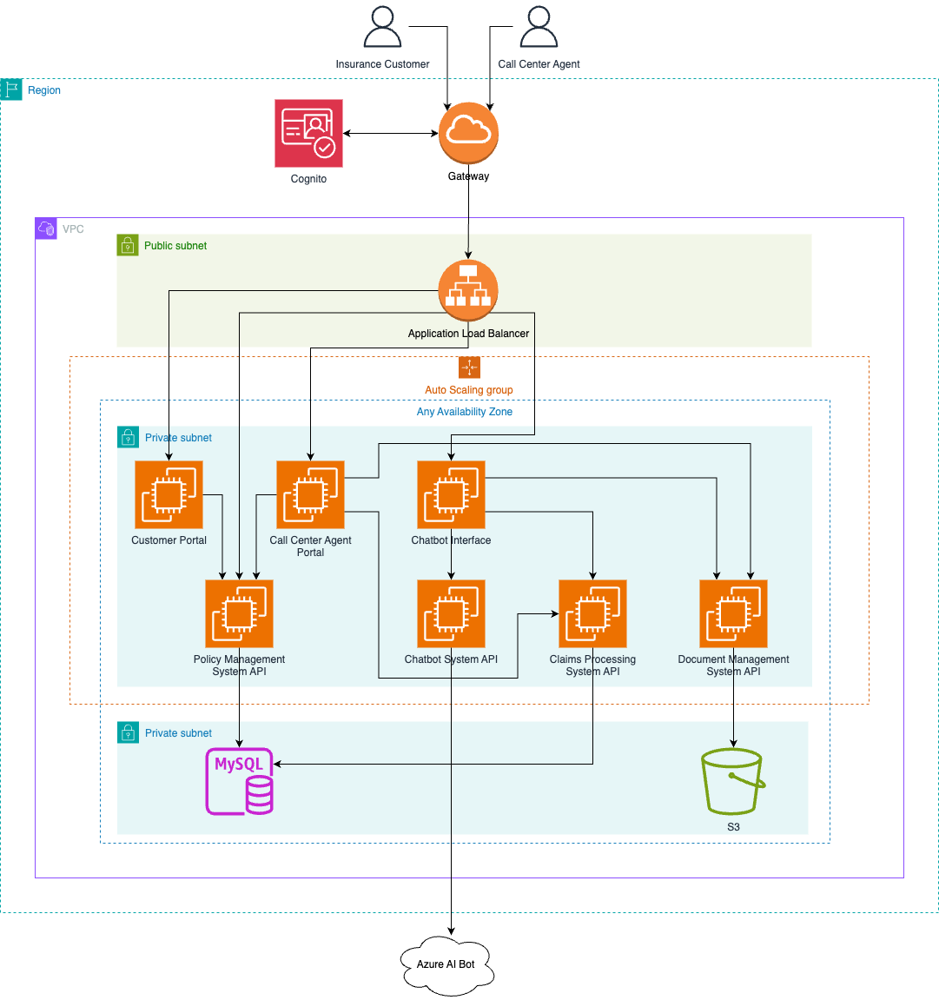
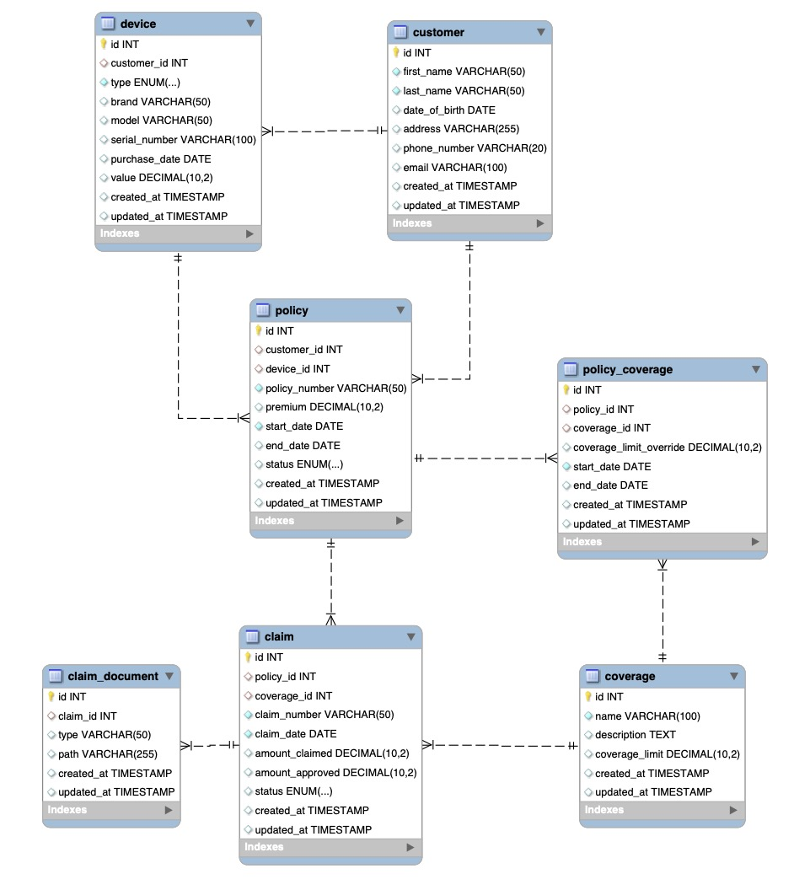

# bolttech-poc

This claim submission system POC is a single page application that has the ability to submit claims on behalf of a customer.
The insurance and coverages provided here are for mobile devices.
It has no auth system in place currently.

The tech stack is:
- React Typescript + Tailwind + Shadcn UI (Frontend)
- Express Typescript (Backend)
- MySQL (Database)

## Context

## Container

## Infrastrucure

## ER Diagram

## Future Improvement

- Add tests
- Add exclusions to make this a more general system
- Add auth system
- Claims could be paginated
- Add filtering to claims